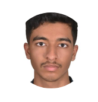
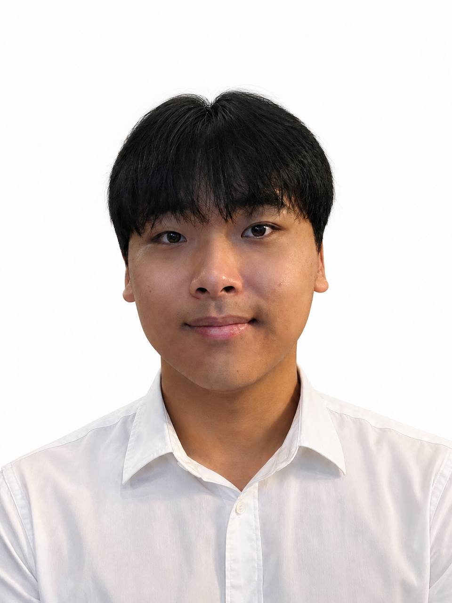
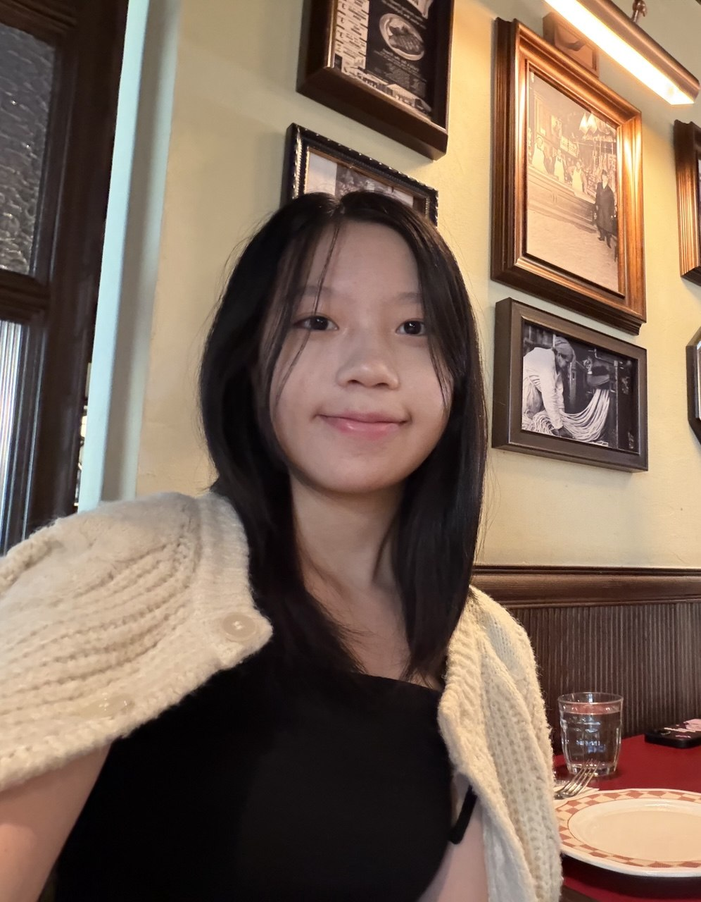
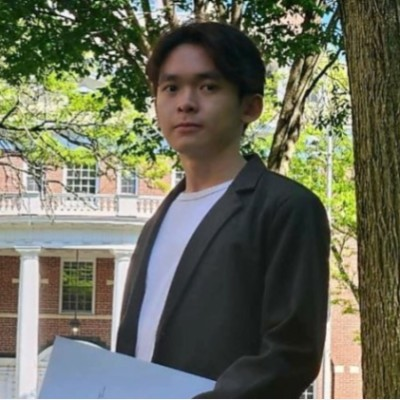

# About Us

We are a team based in the [School of Computing, National University of Singapore](http://www.comp.nus.edu.sg).

You can reach us at the email `seer[at]comp.nus.edu.sg`

## Project team

### Jane Doe

[[github](http://github.com/johndoe)]
[[portfolio](team/johndoe.md)]

* Role: Team Lead
* Responsibilities: UI

### Almarzooq Abdulaziz Moayad A

[[github](http://github.com/aziz-Almarzooq)] [[portfolio](team/johndoe.md)]

* Role: Developer
* Responsibilities:

### Hyunmin Lee

[[github](http://github.com/hyunmin1211)]

* Role: Developer
* Responsibilities: Data

### Selene Chan

[[github](http://github.com/sel-couth-ene)] [[portfolio](team/johndoe.md)]

* Role: Developer
* Responsibilities: Data

### Ray

[[homepage](http://www.comp.nus.edu.sg/~damithch)]
[[github](https://github.com/RayWHJ)]
[[portfolio](team/johndoe.md)]

* Role: Developer
* Responsibilities: 

### Jean Doe

[[github](http://github.com/johndoe)]
[[portfolio](team/johndoe.md)]

* Role: Developer
* Responsibilities: Dev Ops + Threading
